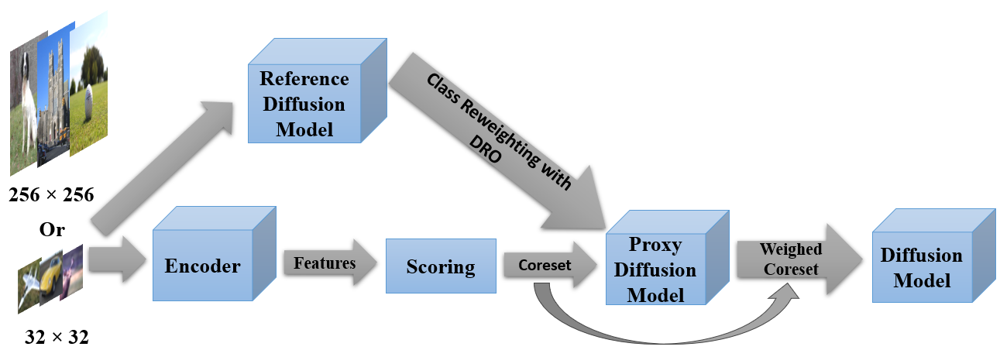

# ⭐ [ICASSP 25'] Pruning then Reweighting: Towards Data-Efficient Training of Diffusion Models
Official codebase for Pruning then Reweighting: Towards Data-Efficient Training of Diffusion Models [ICASSP 25'].
>[Yize Li](https://scholar.google.com/citations?user=_wzQ1EgAAAAJ)<sup>1</sup>, [Yihua Zhang](https://www.yihua-zhang.com/)<sup>2</sup>, [Sijia Liu](https://lsjxjtu.github.io/index.html)<sup>2</sup>, [Xue Lin](https://xuelin.sites.northeastern.edu/)<sup>1</sup><br>
><sup>1</sup>Northeastern University, <sup>2</sup>Michigan State University

>[](https://arxiv.org/abs/2409.19128)</p>

<br>
Coming Soon.

## Citation

If you find our work useful for your project, please consider citing our paper.

```
@INPROCEEDINGS{10888554,
  author={Li, Yize and Zhang, Yihua and Liu, Sijia and Lin, Xue},
  booktitle={ICASSP 2025 - 2025 IEEE International Conference on Acoustics, Speech and Signal Processing (ICASSP)}, 
  title={Pruning then Reweighting: Towards Data-Efficient Training of Diffusion Models}, 
  year={2025}}

```
